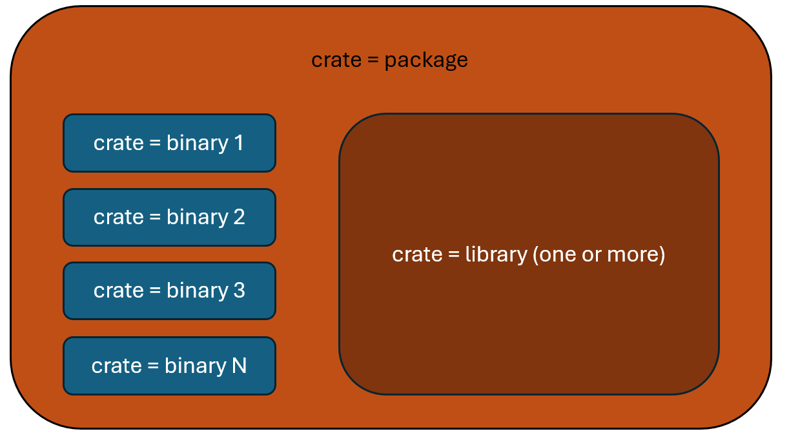

# 1. Introduction

## 1. Intro to the Course
* this is a hands-on course for practical, everyday Rust knowledge
* the contents includes intermediate concepts like
    * idomatic Rust
    * documentation
    * traits
    * testing
    * error (handling)
    * testing
    * and more
* at the end of the course, we'll build a game prototype with the Rust engine
    * this requires a physical machine with a graphics card

## 2. Exercise Overview
* this course comes with exercises available through [this repo](https://github.com/CleanCut/ultimate_rust2)
* you can clone this repo to do the exercises on your own machine or in a virtual environment with Rust compiler toolchain
* each exercise is a small, standalone Rust project, which will compile and run, if you complete tasks

# 2. Intermediate Concepts

## 1. Idomatic Rust
### What is "_ideomatic_"?
1. expressions that are natural to a native speaker
2. appropriate to the style of a particular group
* so ideomatic Rust means using it like a daily practitioner or how it is commonly used by the Rust community

### Tools for Ideomatic Rust
* there are 2 main tools for writing ideomatic Rust
1. `rustfmt`
    * it is the de facto Rust style guide
    * can be run with `cargo fmt` command
    * it takes care of indentation, brace-alignment, trailing commas, etc.
    * it can also be configured through a `.rustfmt.toml` file at the root of the project
2. `clippy`
    * checks for over 450 specific problems
    * there are 4 main types of problems
        1. style
        2. correctness
        3. complexity
        4. performance
    * this makes clippy extremly useful
    * checkout all [linting rules](https://rust-lang.github.io/rust-clippy/master/)
    * can be run with `cargo clippy` command 

### Attributes
* attributes are code decorators that allow you to modify a function, struct or script with very little code
* they always start with a `#` and are framed by `[]`
* e.g.
    ```rust
    #[allow(clippy::too_many_arguments)]
    ```

### Exercises
* I used the following commands
    ```
    cargo fmt
    cargo clippy
    cargo clippy --fix --bin exercise_a --allow-staged
    cargo run
    ```
* I manually implemented the suggestions from `clippy` that could not be done automatically

## 2. Documentation
### Generating Documentation 
* documentation is only useful, if it's readable
* Rust can generate a website (html-files) with standardized documentation layout with ` cargo doc`
* but even better is the command `cargo doc --no-deps --open`
    * `--no-deps` will not render documentation for dependencies (only for your code)
    * `--open` will open the index page of the documentation

### Writing Documentation
* there are two styles of documentation
    1. triple slash (per-line style)
    2. double asteriks (block style)
* these are outer doc-strings (for functions, struct and constants)

#### Triple Slash
* each line of a doc-string beginswith 3 slahes `///`
* we want to document the following constant
    ```rust
    /// Number of pieces in the puzzle
    pub const PUZZLE_PIECES: u32 = 42;
    ```
* these doc-strings are always written above the constant or function-signature
* the rendering of doc-string support common **markdown syntax** with headers, bold/italic, links, code snippets, etc.
    * beware that code snippets inside doc-strings must be valid rust
* let's add some infos to our constant:
    ```rust
    /// Number of pieces in the puzzle
    ///
    /// # History
    ///
    /// This is a separate paragraph.
    /// - Clickable link: [`PUZZLE_PIECES`]
    /// - We tried `7`, but this is better 🧩
    pub const PUZZLE_PIECES: u32 = 42;
    ```
* here is another example for a `struct`
    ```rust
    /// This is a puzzle
    pub struct Puzzle {
        /// Number of pieces
        pub num_pieces: u32,
        /// Descriptive name
        pub name: String,
    }
    ```
* and for associated `impl`
    ```rust
    impl Puzzle {
        /// Make a new puzzle
        pub fn new() -> Self {
            Self {
                num_pieces: PUZZLE_PIECES,
                name: "Forest Lake".into(),
            }
        }
    }
    ```

#### Double Asteriks
* we can also write documentation using a multi-line comment style with double asteriks
    ```rust
    /**
    Number of pieces in the puzzle

    # History

    This is a separate paragraph.
    - Clickable link: [`PUZZLE_PIECES`]
    - We tried `7`, but this is better 🧩
    **/
    pub const PUZZLE_PIECES: u32 = 42;
    ```
* the rest of the markdown features are almost the same
* for markdown links
    * any code object in scope of the script can be linked
    * any code object out of scope can be linked with an absolute path
    ```rust
    /// [Spawn a thread](std::thread::spawn)
    ``` 

#### Inner Doc-Strings
* are used to document libraries and modules
* these are constructed with 
    * `//!` for per-line style
    * `/*! !*/` for block style 
* let's write documentation for our puzzle library
    ```rust
    //! HI! I'm a friendly Rust Puzzle Library.
    //!
    //! This is my documentation
    ```
### Exercise
* render the documentation by running `cargo doc --no-deps --open`
* challenge solution
    ```
    cargo doc --help | grep private
      --document-private-items  Document private items
    ```

## 3. Publishing
### Publishing on Crates.io
* [crates.io](www.crates.io) is Rust's community crate registry
* whatever you publish there will be **permanent**
    * don't publish your private credentials, ssh keys, API keys, access tokens, etc.
* package names need to be _unique_ because there is only one global namespace for all crates

Publication Pre-Requisites
1. log into crates.io with you GitHub account
2. goto account settings and generate an access token
3. run `cargo login` using your access token
4. have package that you want to publish

Polishing the `Cargo.toml`
* the `Cargo.toml` has many additional fields that can provide useful information to the users of your crate
* here is an example from the ´rusty_engine´
    ```toml
    [package]
    name = "rusty_engine"
    version = "6.0.0"
    description = "Learn Rust with a simple, cross-platform, 2D game engine."
    edition = "2021"
    homepage = "https://github.com/CleanCut/rusty_engine"
    repository = "https://github.com/CleanCut/rusty_engine"
    readme = "README.md"
    keywords = [ "game", "engine", "graphics", "audio", "rusty" ]
    categories = [ "game-engines" ]
    license = "MIT OR Apache-2.0"
    ```
    * adding a code `repository` makes it easier for other users to contribute or report issues
    * `keywords` allows a max of 5 SEO-keywords to for better finding your crate on Crates.io
    * `categories` allows a max of 5 _valid category slugs_ from Crates.io

### Publishing
* after the initial setup and after you developed a package, you can publish with `cargo publish`
    ```console
    $ cargo publish --help
    Upload a package to the registry  

    Usage: cargo.exe publish [OPTIONS]

    Options:
    -n, --dry-run              Perform all checks without uploading
        --index <INDEX>        Registry index URL to upload the package to
        --registry <REGISTRY>  Registry to upload the package to
        --token <TOKEN>        Token to use when uploading
    -h, --help                 Print help

    Package Selection:
    -p, --package [<SPEC>]  Package to publish
    ```
* this will re-compile (only publishes if compiled without error), check the versioning, check for un-committed code, etc.
* anything published on Crates.io automatically gets its documentation published online on [docs.rs](https://docs.rs/) (for free)

### No Exercise
* there will be no exercise to prevent useless crates from littering Crates.io and limiting the the unique global namespace
* if personal namespacing will be implemented for Crates.io, this section will be updated with an exercise

## 4. Closures
### What are closures?
* a closure is an anonymous, enclosed function that can borrow or capture some data from the scope it is nested in
* the syntax consists of a parameter list in pipes and an expression (in curly braces)
    ```rust
    |params| expr
    |params| {expr1; expr2}
    ```
* it can also be assigned to a variable and called later 
* the compiler will automatically figure out the parameters types and return types by how you use the closure
* example
    ```rust
    let add = |x, y| x + y;
    let z = add(1, 2) // returns 3 
    ```

### Capturing and Borrowing
* a closure will automatically borrow a reference to the values in the enclosing scope
* example
    ```rust
    let s = "🍓";
    let f = move || {
        println!("{}", s);
    };
    f(); // prints 🍓
    ```
* the value borrowed by the closure must live at least as long as the closure (otherwise the code will not compile)
* closures also support `move` semantics which allows to transfer the ownership of the variable to the closure (remedying the lifetime issue)

### Closures in Higher-Order Function
* in order to use closures as function parameters, then need to be type-annotated from [`std:ops`](https://doc.rust-lang.org/std/ops/index.html) with
    * `Fn`
    * `FnMut`
    * `FnOnce`

## 5. Iterators
### Iterators
* in the previous course, we learned that `for` loop can iterate over any any iterable collection
* but what makes a collection data type iterable?
* a collection becomes iterable through the method `.int_iter()` which is implemeted onto a struct via the trait `IntoIterator`
* anything that implements this trait can called iterator function
* the method `.int_iter()` returns an iterator which takes _ownership_ of the collection it is called on and consumes the collection

Examples
* `for` loop style iteration
    ```rust
    let v = vec![6, 7, 8, 9];
    for n in v.into_iter() {
        println!("{}", n);
    }
    ```
    * a vector implements the trait `IntoIterator`
    * a vector automatically turns into an iterator in a `for` loop
    * that means if a vector goes out of scope at the end of the loop
* functional style iteration
    ```rust
    let v = vec![6, 7, 8, 9];
    v.into_iter().for_each(|num| println!("{}", num));
    ```
* functional iterator are faster than for loops
    * this is because `for` loop may be compiled line-by-line
    * whereas the whole functional iterator is evaluated by the compiler and optimized together

### Iterator Adaptors
* in functional paradigm, the iterator adaptor takes an iterator and outputs a different iterator and takes some action on values that are passed through 
* many iterator methods in Rust are also iterator adaptors, allowing for method chaining
    ```rust
    let v = vec![6, 7, 8];
    let total: i32 = v
        .into_iter()            //  6,  7,  8
        .map(|x| x * 3);        // 18, 21, 24
        .filter(|y| *y % 2 == 0)// 18, 24
        .sum();                 // 42
    ```
    * `.map()` applies a function or closure to each value (and passed them along)
    * `.filter()` evaluates a condition and only values that evaluate true under this condition are passed along
    * `map`'s closure takes ownership of its values but `filter`'s closure only takes an immutable reference
    * iterator adaptors need to end in _iterator consumer_ causing the chain of adaptors to actually process
* how do you what each iterator adaptor need?
    * every iterator adaptor is documented

### Iterator Consumers
    * `.for_each()` passes each values to a closure and consumes them indivdually
    * `.sum()` is another useful consumer
    * `.collect()` gather all the values passed through the iterator chain and puts them into a new collection
* but iterators rely heavily on generics that the compiler can't know anymore what is the result of the final data type
    * you can either annotate the variable the iterator feeds into
    * or you can use the turbofish `::<>` syntax
* the turbofish `::<>` declares the type of generic function
    * it goes between the method/function name and the argument list: `.sum::<i32>()`
* a special consumer is the `.drain()` that removes some or all values from a collection and returns the empty collection

### Mutable Iterators
* what if you don't want to consume the collection while iterating over it?
    * you can eihter call the method     
    ```rust
    v.into_iter()   // consumes v, returns owned items
    v.iter()        // returns immutable references
    v.iter_mut()    // returns mutable references
    ```
    * or use its syntactic sugar
    ```rust
    for _ in v      // v.into_iter()
    for _ in &v     // v.iter()
    for _ in &mut   // v.iter_mut()
    ```
* hashmaps have iterator methods that can go over keys only, values only, or key-value pairs together

## 6. Common Traits
* we will learn about traits from the standard library
* what can implement a trait? -> 4 things
    1. `struct`s
    2. `enum`s
    3. `closure`s
    4. `function`s
* but closures and functions can only implement a view advanced traits, we will focus on implementing traits for structs and enums

### Derivable Traits
* a trait can be derived if it has a `#[derive()]` macro defined it
* the documentation for a trait will tell if it can be derived

#### Debug
* the most common trait to derive is `Debug`
    ```rust
    #[derive(Debug)]
    pub struct Puzzle {
        pub num_pieces: u32,
        pub name: String,
    }
    ```
* as long as all elements inside your struct or enum also have this trait, it can be derived for the super entity
* all primitives and most standard library types already posses the trait
* Debug trait is used for debug formatting
```rust
println!("{:?}", puzzle); // Debug 
println!("{:#?}", puzzle); // Pretty Debug
```
* `"{:?}"` tries to create a one line representation of the struct
* `"{:#?}"` tries to create a multi-line, indented representation of the struct

#### Clone
* another common trait to derive is `Clone`
    * allows an object to be cloned by called the method `.clone()`
    ```rust
    #[derive(Clone, Debug)]
    pub struct Puzzle {
        pub num_pieces: u32,
        pub name: String,
    }
    // ...
    let puzzle2 = puzzle.clone()
    ```
* Rust is not an interpreted language like Python or Ruby, where the interpreter can introspect objects at run-time
* therefore, Rust objects need to implement `Clone` at compile-time

#### Copy
* related to `Clone` is the `Copy` trait 
    * copy is a sub-trait of clone, meaning it cannot be derived without the parent trait 
* if your type implements `Copy`, then it will be copied instead of moved in `move` situations
* this makes sense for small values that fit entirely on the stack (integer, float, boolean have copy trait)
* if a type uses the heap, it cannot implement `Copy`
* for our `Puzzle` example, we cannot derived `Copy` since `String` uses the heap
* another example with single type `enum`
    ```rust
    #[derive(Clone, Copy)]
    pub enum PuzzleType {
        Jigsaw
    }
    ```
    * small types likes enums are easier to copy than to deal with references and move semantics

### Standard Library Traits
* there are 3 steps to manually implement a trait
    1. bring it into scope
    * some traits are in the standard library prelude (automatically in scope)
    * but many useful traits need to imported first
    2. boilerplate
    * write the interfaces that are needed for this trait
    * your IDE can generate a skeleton or you can copy it from the documentation
    3. implementation
    * write the actual functions that you want to implement

#### Default
* the `Default` trait is included in the standard library prelude (already in scope)
* it gives you zero numbers, empty strings, and empty collections, but we can use to define our type's own default-values
    ```rust
    impl Default for Puzzle {
        fn default() -> Self {
            todo!();
            //panic!("not yet implemented");
        }
    }
    ```
* let's write the actual implementation
    ```rust
    impl Default for Puzzle {
        fn default() -> Self {
            Puzzle {
                num_pieces: PUZZLE_PIECES,
                name: "Forest Lake".to_string(),
            }
        }
    }
    ```
* there are several patterns of idiomatic usage
    * initialize a struct with some default values
    ```rust
    let puzzle = Puzzle {
        num_pieces: 3000,
        ..Default.default()
    }
    ```
    * the `..` is the range operator and using it this way fills out all remaining values (called "struct update syntax")

#### PartialEq / Eq
* partial equality and equality traits are `PartialEq` and `Eq`
* `PartialEq` does the actual calculations to test for equality
* `Eq` is a marker trait for when the equality logic is _reflexiv, transitive and symmetric_
    * _reflexiv_: any number `a` is equal to itself `a == a`
    * _transitive_: for any numbers: `a, b, c`; if `a == b` and `b == c`, then `a == c`
    * _symmetric_: any numbers: `a, b`; if `a == b` then `b == a`
* let's write the actual implementation
    * remember `&` is an immutable reference
    * this compares to objects of the same type against ech other returning a `true` when equal and a `false` when unequal
* 1st impl for `PartialEq` & `Eq`
    ```rust
    impl PartialEq for Puzzle {
        fn eq(&self, other: &Self) -> bool {
            (self.num_pieces == other.num_pieces) && (self.name && other.name)
        }
    }

    impl Eq for Puzzle {} // marker trait
    ```
    * implementing `eq` allows us to use the struct as a key in a hashmap 
* 2nd impl for only `PartialEq`
    ```rust
    impl PartialEq for Puzzle {
        fn eq(&self, other: &Self) -> bool {
            (self.num_pieces == other.num_pieces) &&
            (self.name.to_lowercase() && other.name.to_lowercase())
        }
    }
    ```

#### From / Into
* they are an extremely useful pair (included in the standard prelude)
* if you implement `From`, then `Into` gets automatically implemented for you
    * so implement `From` to get both
* however, it's more ideomatic to use the `Into` in generic functions
* they describe the transformation between two types fro, different viewpoints
    ```rust
    From<T> for U
    Into<U> for T
    ```
* for our example, we want to have
    ```rust
    From<Puzzle> for String
    Into<String> for Puzzle    
    ```
* in this "conversion" for our example, we want to keep the name and lose the info on number of pieces
    ```rust
    impl From<Puzzle> for String {
        fn from(puzzle: Puzzle) -> Self {
            puzzle.name
        }
    }
    // use `From` like this
    let puzzle = Puzzle::default();
    let s = String::from(puzzle);
    // use `Into` like this
    let t: String = puzzle.into();
    ```
* usage in generic functions
    ```rust
    pub fn show<T: Into<String>>(s: T) {
        println!("{}", s.into());
    }
    ```
    * the input argument is of generic type `T`, which is quanlified as anything that can turn into a string `<T: Into<String>>`
* BUT the drawback of `From`/`Into` implemenation is that it consumes the puzzle
    * to avoid this we can use immutable references `&` and cloning
    * be careful with cloning though, because cloning large objects is expensive
    ```rust
    impl From<&Puzzle> for String {
        fn from(puzzle: &Puzzle) -> Self {
            puzzle.name.clone()
        }
    }
    // use in the generic show function
    let puzzle = Puzzle::default();
    show(&puzzle);
    ```

## 7. Creating Errors
* we'll learn to create our own errors (for our own library)

### Error Building Essentials
1. `enum`:
    * errors should be enums
    * technically, everything that implements the error trait can be an error
    * but doing it through enums is both easier and ideomatic
    ```rust
    pub enum PuzzleError {
        WontFit(u16),
        MissingPiece,
    }
    ```
2. _group_: 
    * group your error as variants of as few enums as possible/ as makes sense
3. _return_:
    * return only your own errors from your own library
    * convert other lib's error into your own
    ```rust
    // error from another lib used in my lib
    pub enum FractalError {
        SadSnowflake,
    }

    pub enum PuzzleError{
        WontFit(u16),
        MissingPiece,
        PrettyImageless, // adopted from FractalError  
    }
    ```
    * not doing this
        * gives external dependencies the ability to break your public API
        * prevents you from updating your lib's backend without breaking your API
    * the exceptions are std lib errors which can be passed through
4. `non-exhaustive`
    * your error enum should be non-exhaustive
    * by default, enums in Rust are exhaustive but the `#[non_exhaustive]` attribute enables that
    ```rust
    #[non_exhaustive]
    pub enum PuzzleError{
        WontFit(u16),
        MissingPiece,
    }
    ```
    * this makes it so you can't match without a wildcard
    ```rust
    match my_error {
        PuzzleError::WontFit(_) => {}
        PuzzleError::MissingPiece => {}
        _ => {} // default arm in match
    }
    ```
    * this prevents new error-variants from breaking user code
5. `Debug+Display+Error`
    * implement the `Debug`, `Display`, `Error` traits in that order
    * because the `Error` is sub-trait of `Debug` and `Display`
    ```rust
    // 1. Debug
    #[derive(Debug)]    
    #[non_exhaustive]
    pub enum PuzzleError{
        WontFit(u16),
        MissingPiece,
    }

    // 2. Display
    use std::fmt::{Display, Formatter, Result};

    impl Display for PuzzleError {
        fn fmt(&self, f: &mut Formatter) -> Result {
            use PuzzleError::*;
            match self {
                PuzzleError::MissingPiece => write!(f, "Missing a piece"),
                PuzzleError::WontFit(n) => write!(f, "Piece {} doesn't fit!", n),
            }
        }
    }

    // 3. Error
    use std::error::Error,

    impl Error for PuzzleError {} // does not require any additional functionality
    ```


### `thiserror`
* from all previous steps, step 5 requires the most labor
* but there is an easier way thanks to the `thiserror` crate
* add it to dependencies section in the `Cargo.toml`
    ```toml
    [dependencies]
    thiserror = "1.0"
    ```
* now we can bring it into scope
    ```rust
    use thiserror::Error;

    #[derive(Debug, Error)]    
    #[non_exhaustive]
    pub enum PuzzleError{
        #[error("Piece {0} doesn't fit!")]
        WontFit(u16),
        #[error("Missing a piece.")]
        MissingPiece,
    }
    ```
    * the `thiserror::Error` is a derive macro that will implement both `Display` and `Error` trait
    * the return string for the `Display` trait is specified by annotation
* this approach is **functionally identical** and requires **much less code**!

## 8. Handling Errors
* how do you handle error in an application?

### Recap
* recap of the `Result` enum
    * it has only two variants that wrap either the intended output or an error
    ```rust
    #[must_use]
    enum Result<T, E> {
        Ok(T), // wraps generic output
        Err(E),// wraps generic error
    }
    ```
* there are 2 types of errors (from viewpoint of handling)
    1. non-recoverable
    2. recoverable

### 1. Non-Recoverable Errors
* there is no way for the program to proceed, then use the `panic!` macro which crashes the program
    ```rust
    // manually panic
    panic!("Your computer is on fire ️‍🔥");

    // same thing if result is Result::Err
    result.expect("Your computer is on fire ️‍🔥");

    // same thing, but without message
    result.unwrap();
    ```
* only use this option, if you're certain there is not other way

### 2. Recoverable Errors
#### Handle
* if an error is recoverable, we can use the the `if let` pattern
    * this is very useful when the error is more important than the success
    ```rust
    if let Err(e) = my_result {
        println!("Warning: {}", e);
    }
    ```
    * if the pattern `Err(e)` matches the variable, the value is bound by the `if`-block
* if you want to supply a default value in case of error, use a `match`-expression to handle both the error and success case
    ```rust
    let score = match get_saved_score() {
        Ok(x) => x,
        Err(_) => 0,
    }
    ```
    * this long `match`-expression can be simplified to
    ```rust
    let score = get_saved_score().unwrap_or(0);
    ```

#### Return
* when we want to return an error, we can also use use a `match`-expression
    ```rust
    fn porm() -> Result<String, io::Error> {
        let file = match File::open("pretty_words.txt") {
            Ok(f) => f,
            Err(e) => return Err(e),
        }
        // do stuff with file
    }
    ```
    * if the function does not know how to handle the error, we hand to the caller
* this pattern is so common that Rust provides a syntactic shorthand `?` (the question-mark operator)
    ```rust
    fn porm() -> Result<String, io::Error> {
        let file = match File::open("pretty_words.txt")?;
        // do stuff with file
    }
    ```
    * this approach is **functionally identical** and requires **much less code**!
* the `?` operator can also be chained
    ```rust
    optimus.stand()?.transform()?.rollout()?.chase()?;
    ```

### Handling Errors in Applications
* what if we're dealing iwht multiple errors types
* for lib: convert errors of other libraries and dependencies into your own types
* for applications, we can leverage traits
* there is a long-wieldy manual way, but this time we skip to shorter version
* add `anyhow` to dependencies section in the `Cargo.toml`
    ```toml
    [dependencies]
    anyhow = "1.0"
    ```
    * check out the[ documentation](https://docs.rs/anyhow/latest/anyhow/)
    * you can also [`eyre`](https://docs.rs/eyre/latest/eyre/) or [`snafu`](https://docs.rs/snafu/latest/snafu/)
* in this example, we want to load a puzzle from a file, but multiple errors could occur
    * interacting with the filesytem can cause IO-errors
    * loading data from file can cause issues 
    ```rust
    use anyhow::{Context, Result};
    use puzzles::Puzzle;
    use std::fs::File;

    fn get_puzzle(filename: &str) -> Result<Puzzle> {
        let fh = File::open(filename)
            .with_context(|| format!("couldn't open the file {}", filename))?;
        let puzzle = Puzzle::from_file(fh).context("couldn't covert data into puzzle")?;
        Ok(puzzle)
    }
    ```
    * the `anyhow::Result` let's you specify the Ok type without the need to specify mulitple error types
    * the `anyhow::Context` acts as better replacement for `.expect()` 

## 9. Unit Tests
### Basics of Unit Testing
* unit testing is about testing small parts of code
* the ideomatic place for unit tests is inside their own submodule at the bottom of the same file
* the convention is to put this sumodule inline by calling it `mod test`
* but we don't want to compile the tests into release version of the code, so we use the attribute `#[cfg(test)]`
* in sinde the sub-module, we need access to the things we want to test via `use super::*`
    ```rust
    pub fn snuggle(bunnies: u128) -> u128 {
        bunnies * 8
    }

    #[cfg(test)]
    mod test {
        use super::*,

        #[test]
        fn snuggling_bunnies_multiply() {
            assert_eq!(snuggle(2), 16);
        }
    }
    ```
* there are 3 assert macros
    * `assert_eq!(a, b)` takes two arguments of the same type that implement `PartialEq` trait, succeeds when the arguments are equal
    * `assert_ne!(a, b)` takes two arguments of the same type, succeeds when the arguments are not equal
    * `assert!(a >= b)` covers the rest of the logical conditions through expression that evaluate to boolean values
* panicking fails the test unless it is marked with the attribute `#[should_panic]` 
* tests with result type in return value
    ```rust
    #[test]
    fn bunny_result() -> Result<(), ParseIntError> {
        let num_bunnies: u64 = "four".parse()?;
        assert_eq!(num_bunnies, 4);
        Ok(())
    }
    ```
    * when we run a failing test, the test-run may stop after the first fail
* tests are run with `cargo test`
    * to run a specific unit test, specify like this
    ```
    cargo test test::bunny_result()
    ``` 

### Crates and Libraries
* there are two definitions of crate
    1. crate = package (which can contain a library)
    2. crate = a library or a binary
    <p align="left">
    
    </p> 
* in the official Rust documentation, the second is always used

## 10. Integration Tests
### Basics of Integration Tests
* integration tests run validate the interaction between larger pieces of code
* they go into a separate directory at the root of the project
    ```
    .
    ├── Cargo.lock
    ├── Cargo.toml
    ├── /src
    │   └── lib.rs
    └── /tests
    ```
* any file in the tests directory will be searched for tests
* inside you can import the functions from the libraries and mark tests with attribute `#[test]`
* on this level it works pretty much like unit testing in the sense that you write functions that validate the proper interaction of components

### Binary vs Library
* the convention is to put as little as possible in your binary (`main.rs`) and as much as possible into your library (`lib.rs`)
* so that you don't need to test your binary
* why? because it is a hassle!
* you need to run you binary through `std::process::Command` inside a sup-process and test the outputs on this outside level

## 11. Benchmarks
### Introduction to Benchmarking
* Rust has a built-in way to benchmark your code (in nightly and not yet fully stable)
* instead we will use `Criterion`, an established benchmarking package
* this is package we want to add in dev-dependencies section of Cargo.toml
    ```toml
    [dev-dependencies]
    criterion = { version = "0.3", features = ["html_reports"] }

    [[bench]]
    name = "snuggle_speed"
    harness = false
    ```
    * dev-dependencies don't get compiled into the release version
    * there can be several `bench` section so we need double square brackets
* similar to integration testing, we need a separate directory at root level
    ```
    .
    ├── Cargo.lock
    ├── Cargo.toml
    ├── /src
    │   └── lib.rs
    └── /benches
       └── snuggle_speed.rs
    ```
    * the file inside the benches directory needs to match the one Cargo.toml
* here is an example 
    ```rust
    use criterion::{black_box, criterion_group, criterion_main, Criterion};
    use hello::snuggle;

    pub fn snuggle_benchmark(c: &mut Criterion) {
        c.bench_function(
            "snuggle 2", |b| b.iter(|| snuggle(black_box(2)))
            // "snuggle 2" is a string for the later display
            // b.iter is the repeated call for benchmarking
            // snuggle() is the function to be benchmarked
            // black_box() is wrapper for input arguments to prevent unwanted compiler optimization
        );
    }

    criterion_group!(benches, snuggle_benchmark);
    criterion_main!(benches);
    ```
* execute your benchmark tests with `cargo bench`
* the generated HTML-reports have been saved to `target/criterion/report/index.html`

### Tips for Benchmarking
* implement the function in readable, ideomatic Rust
* don't assume which functions are slow, run benchmarks to empiric
* if possible, compare several implementations
* to be generally accurate, don't run benchmarks on busy machines
* to be specifically accurate, run benchmarks in a prod-like environment

## 12. Logging
### Basics of Logging
* logging is not included in the standard library
* but there is a de-facto default library called `log` 
* let's add this to our puzzles library
    ```toml
    [dependencies]
    log = "0.4"
    ```
* there are 5 levels of logging with corresponding macro
    * they are listed in descending order of priority
    ```rust
    use log::{error, warn, info, debug, trace};

    error!("Serious stuff");
    warn!("Pay attention");
    info!("Useful stuff");
    debug!("Extra info");
    trace!("All the things");
    ```
    * macros are imported with exclamation mark but called with exclamation
* at run-time a level of priority will be set
    * all message of equal or higher priority to the level will be sent
    * lower priority messages will be omitted
* logging macros utilities
    * they can take a `target:` argument to indicate the module 
    * when no `target:` they will default to the actual name of the module
    * they also accept println-macro style strings with curly braces for arguments
    * this helps to show which variable may have faulty or unexpected contents

### Logging Output
* the log library defines a common interface via traits that works across your modules
* but we also need to specify where the message from logging go
* NOTE: the logging output library is separate from the log library itself
    * and there are many different ones to choose from
    * simple output logger:
        * `env_logger`
        * `simple_logger`
        * `simple_log`
        * `pretty_env_ log`
        * `stderrlog`
    * for compatibale output logger, view the [`log` documentation](https://docs.rs/log/latest/log/#available-logging-implementations) 
* let's add the `env_logger` to our Cargo.toml
    ```toml
    [dependencies]
    log = "0.4"
    env_logger = "0.9"
    ```
* inside the `main()` function at the top initialize the logger
    ```rust
    fn main() -> Result<()> {
        env_logger::init();
    }
    ```
    * the default level is error
    * the level is controlled via the environment variable `RUST_LOG`
    * we can temporarly change it by running `RUST_LOG=info cargo run`
* the advantages of this setup: ubiquitious and easry to apply

### Exercise
* view the logging output in console:
    ```terminal
    $ RUST_LOG=trace cargo run
        Finished dev [unoptimized + debuginfo] target(s) in 0.03s
        Running `target\debug\exercise_g.exe`
    [2024-07-03T11:04:53Z DEBUG exercise_g] A frog has been created
    [2024-07-03T11:04:53Z TRACE exercise_g] A default frog was generated: Frog { energy: 5, sleeping: false }
    [2024-07-03T11:04:53Z INFO  exercise_g] The frog has 4 left
    [2024-07-03T11:04:53Z INFO  exercise_g] The frog has 3 left
    [2024-07-03T11:04:53Z INFO  exercise_g] The frog has 2 left
    [2024-07-03T11:04:53Z INFO  exercise_g] The frog has 1 left
    [2024-07-03T11:04:53Z INFO  exercise_g] The frog has 0 left
    [2024-07-03T11:04:53Z WARN  exercise_g] The frog has run out of energy and will go to sleep
    [2024-07-03T11:04:53Z ERROR exercise_g] The frog is already sleeping
    [2024-07-03T11:04:53Z ERROR exercise_g] The frog is already sleeping
    ```

## 13. Multi-Threading
### Recap & Foundations
* Rust has a portable, built-in API wrapping native operating system threads (including but not limited to MacOS, Linux, Windows)
* every process or program starts with a single thread → **main thread**
* but a process can run multiple thread because
    * running multiple threads is cheaper than running mulitple processes
    * threads in the same process can share memory
* each CPU core can only run a single thread
* parallel processing is when you want to process thing on multiple CPUs at the same time
    * creating thread allocates a RAM for the thread's own stack (a couple of megabytes)
    * whenever a CPU switches from one thread to another it has to an expensive context switch
    * more threads on one core means more overhead
* multi-threading vs async-await
    * if you want to continue doing some work on the main thread while you wait on disk-IO or network-IO, then you want to use async-await
    * more efficient way to wait concurrently
* from Course 1, you should remember this basic setup
    ```rust
    use std::thread;

    fn main() {
        let handle = thread::spawn{move ||
            // do stuff in child thread
        };

        // do stuff simultaneously in main thread

        // wait until all threads exited
        handle.join().unwrap();
    }
    ```

### Implementation Example
* in our example, we want to make spaghetti, which consists
    * cooking spaghetti
    * cooking sauce
    * setting the table
* to simulate parallizable tasks, we implement to people mom and dad who execute these tasks
    ```rust
    use log::{error, info};
    use std::thread;
    use std::time::Duration;
    use std::env;

    fn sleep(seconds: f32) {
        thread::sleep(Duration::from_secs_f32(seconds));
    }

    pub mod dad {
        use super::{info, sleep};

        pub fn cook_spaghetti() -> bool {
            info!("Cooking the spaghetti...");
            sleep(4.0); // blocks the thread for 4 sec
            info!("Spaghetti is ready!");
            true // returns true and releases the thread
        }
    }

    pub mod mom {
        use super::{info, sleep};

        pub fn cook_sauce_and_set_table() {
            sleep(1.0);
            info!("Cooking the sauce...");
            sleep(2.0);
            info!("Sauce is ready! Setting the table...");
            sleep(2.0);
            info!("Table is set!");
        }
    }

    fn main() {
        if env::var("RUST_LOG").is_err() {
            // set the log-level to info
            env::set_var("RUST_LOG", "info")
        }
        env_logger::init();

        // spawns a separate thread, we're other tasks happen
        let handle = thread::spawn(|| dad::cook_spaghetti());

        // mom thread starts and runs in parallel to dad thread
        mom::cook_sauce_and_set_table();

        // it is clean to join threads
        // otherwise it kills all child thread when main exits
        if handle.join().unwrap_or(false) {
            info!("Spaghetti time!");
        } else {
            error!("Dad messed up the spaghetti");
        }
    }
    ```
* you can run this code online at the [Rust playground](https://play.rust-lang.org/?version=stable&mode=debug&edition=2021)
    * no Cargo.toml or anything else is required
* this generates the following output
    ```
    [2024-07-03T14:23:22Z INFO  playground::dad] Cooking the spaghetti...
    [2024-07-03T14:23:23Z INFO  playground::mom] Cooking the sauce...
    [2024-07-03T14:23:25Z INFO  playground::mom] Sauce is ready! Setting the table...
    [2024-07-03T14:23:26Z INFO  playground::dad] Spaghetti is ready!
    [2024-07-03T14:23:27Z INFO  playground::mom] Table is set!
    [2024-07-03T14:23:27Z INFO  playground] Spaghetti time!
    ```

## 13. Channels
### Channel Libraries
* now, we know how to start a thread, but do they communicate?
* threads can send information between each other requiring a channel
* the standard library has channels `std::sync::mpsc`
    * this was created by the original Rust Servo team
    * but it has many design-flaws and removing/ rewriting them would break compatibility
    * breaking compatibility of a standard library is not permissable 
* the `crossbeam::channel` has become the alternative
    * they are faster, more efficient, and have more features

### Basics of Channel 
* a channel is a one-way queue that threads can use to send type of value to another thread
* for a value to be able to send, it needs the `Send` trait (a marker trait)
* all primitives and most std-lib types are `Send`-able
* there are two flavors of channels
1. Bounded: `channel::bounded(8)`
    * a bounded channel has fixed capacity
    * once full it will block the thread from sending any more values through the channel
    * sending can resume, once a receiver thread pull something out of the channel
2. Unbounded: `channel::unbounded()`
    * the size of this channel will grow indefinitely (until you run out of memory)
* Receivers
    * both types of channels can have multiple receivers
    * which channel will receive the value is undefined
* Senders
    * channels can have multiple senders 
    * first send is first in channel
* Flow of Information
    * you can also multiple receivers and multiple senders on one channel, but the flow only goes in one direction
    * for bidirectional communication, more than one channel is required
    * cyclical communication has potential for deadlock
    * it is good practice to design channels in an acyclic graph

### Implemenation Example
* add `crossbeam` to the Cargo.toml
    ```toml
    [dependencies]
    crossbeam = "0.8"
    ```
* let's build a small cafeteria to illustrate the idea 
    * we'll have a cafeteria worker per thread
    * they'll be converting lunch orders into actual lunches
* inside main.rs, we'll implement channels and threads
    * `Receiver` and `Sender` are traits for our channel
    ```rust
    use crossbeam::channel::{self, Receiver, Sender};
    use std::{thread, time::Duration};

    #[derive(Debug)]
    enum Lunch {
        Soup,
        Salad,
        Sandwich,
        HotDog,
    }

    // each worker gets
    // - a name to identify them
    // - a Receiver End on the Order queue (channel)
    // - a Sender End on the Lunch rollout queue (channel)
    fn cafeteria_worker(name: &str, orders: Receiver<&str>, lunches: Sender<Lunch>) {
        // a channel has IntoIterartor trait and pauses until something is received
        // when the channel is closed, the for-loop ends
        for order in orders {
            info!("{} receives an order for {}", name, order);
            let lunch = match &order {
                x if x.contains("soup") => Lunch::Soup,
                x if x.contains("salad") => Lunch::Salad,
                x if x.contains("sandwhich") => Lunch::Sandwich,
                _ => Lunch::HotDog,
            };
            for _ in 0..order.len() {
                thread::sleep(Duration::from_secs_f32(0.1))
            }
            info!("{} sends a {:?}", name, lunch);

            // the sender end sends something into the channel
            if lunches.send(lunch).is_err() { break; }
        }
    }
    ```
* now for the main function
    ```rust
    use log::info; // logging the outputs show-cases parallel execution  
    use std::env;

    fn main() {
        if env::var("RUST_LOG").is_err() { env::set_var("RUST_LOG", "info") }
        env_logger::init();
        
        // create a channel returns a tuple of sender `tx` and receiver `rx`
        let (orders_tx, orders_rx) = channel::unbounded();
        // cloning a sender means multiple threads can send into the channel
        let orders_rx2 = orders_rx.clone();
        let (lunches_tx, lunches_rx) = channel::unbounded();
        // cloning a receiver means multiple threads can receive from the channel
        let lunches_tx2 = lunches_tx.clone();

        // the child threads get cafeteria workers
        let alice_handle = thread::spawn(|| cafeteria_worker("alice", orders_rx2, lunches_tx2));
        let zack_handle = thread::spawn(|| cafeteria_worker("zack", orders_rx, lunches_tx));

        for order in vec!["polish dog", "caesar salad", "onion soup", "reuben sandwhich"] {
            info!("ORDER: {}", order);
            let _ = orders_tx.send(order);
        }
        // dropping the sending side will close the channel once all orders are received
        // this in turn will also close the order for-loop inside the worker thread
        drop(orders_tx);

        // now we need to receive all prepared lunches back from the kitchen
        for lunch in lunches_rx {
            info!("Order up! -> {:?}", lunch);
        }

        // the main thread cleanly joins and terminates all child threads
        let _ = alice_handle.join();
        let _ = zack_handle.join();
    }
    ```
* run this code online at the [Rust playground](https://play.rust-lang.org/?version=stable&mode=debug&edition=2021)
    ```
    [2024-07-04T10:34:38Z INFO  playground] ORDER: polish dog
    [2024-07-04T10:34:38Z INFO  playground] ORDER: caesar salad
    [2024-07-04T10:34:38Z INFO  playground] ORDER: onion soup
    [2024-07-04T10:34:38Z INFO  playground] ORDER: reuben sandwhich
    [2024-07-04T10:34:38Z INFO  playground] zack receives an order for polish dog
    [2024-07-04T10:34:38Z INFO  playground] alice receives an order for caesar salad
    [2024-07-04T10:34:39Z INFO  playground] zack sends a HotDog
    [2024-07-04T10:34:39Z INFO  playground] Order up! -> HotDog
    [2024-07-04T10:34:39Z INFO  playground] zack receives an order for onion soup
    [2024-07-04T10:34:40Z INFO  playground] alice sends a Salad
    [2024-07-04T10:34:40Z INFO  playground] alice receives an order for reuben sandwhich
    [2024-07-04T10:34:40Z INFO  playground] Order up! -> Salad
    [2024-07-04T10:34:41Z INFO  playground] zack sends a Soup
    [2024-07-04T10:34:41Z INFO  playground] Order up! -> Soup
    [2024-07-04T10:34:41Z INFO  playground] alice sends a Sandwich
    [2024-07-04T10:34:41Z INFO  playground] Order up! -> Sandwich
    ```
    * the output illustrates that all come in at once from the main thread and in the orders queue
    * the orders queue has one sender and two receiver ends, which are passed to the worker threads Alice and Zack
    * the worker threads Alice and Zack each have a sender end for the lunch queue to which they can send out prepared lunches
    * the lunch receiver end is on the main thread and whenever a lunch is received customers are informed to collect

# 3. Game Prototype with Rusty Engine

## 1. Project Overview
## 2. Configuration
## 3. Engine Initialization
## 4. Game State
## 5. Game Logic Function
## 6. Sprites
## 7. Coliders
## 8. Keyboard Input
## 9. Mouse Input
## 10. Text
## 11. Audio
## 12. Timer
## 13. Engine & Game Structs
## 14. Common Setup
## 15. Road Race